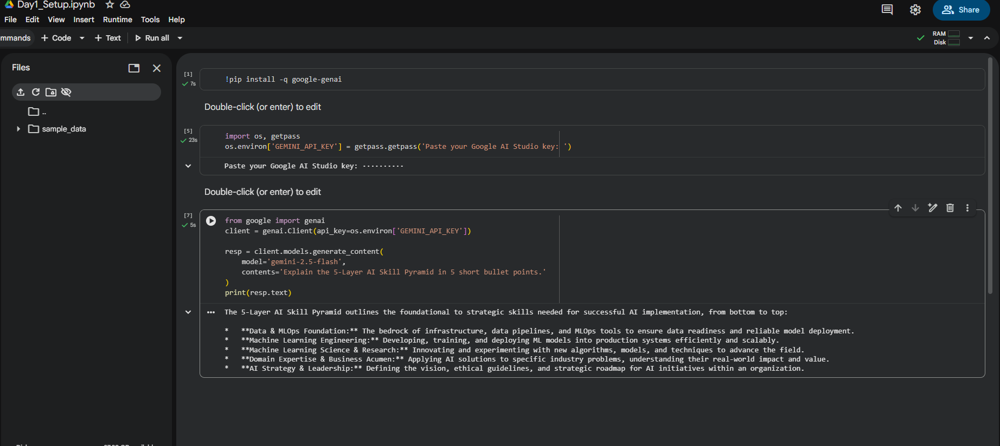
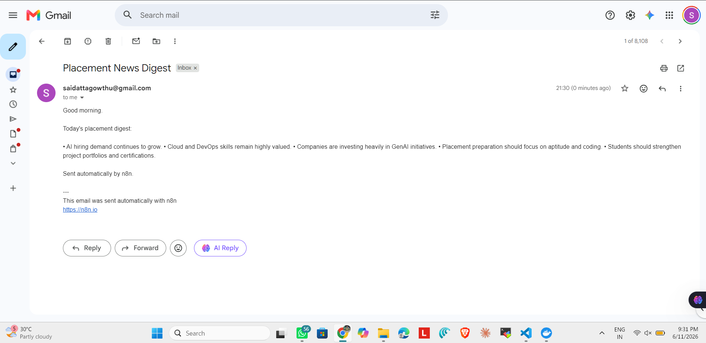

# AI Mentor Bootcamp - Gowthu V V Satya Sai Datta Manikanta

Public portfolio of 12-day AI Trainer Workshop. By Day 12: 6 daily notebooks + capstone Streamlit URL.

## Day 1 - Setup complete

- Google AI Studio API key provisioned
- Groq API key provisioned
- Hello-Gemini call working - see [Day1_Setup_1B.ipynb](Day-1/Day1_Setup_1B.ipynb)
- 4-tool comparison matrix from Lab 1A - see [lab-1A.md](Day-1/lab-1A.md)

### Tool Preference Notes

I would use ChatGPT for general tasks where I need a fast, well-structured response.

I would use Claude for long documents, careful reasoning, and high-stakes writing.

I would use Perplexity for any factual claim I cannot afford to get wrong.

I would use Gemini when I need strong integration with Google's ecosystem, multimodal tasks, or help working across Google services such as Docs, Gmail, Drive, and Search.

## Day 2 - Prompt patterns and resume extraction

- Resume extractor notebook - see [Day2_ResumeExtractor.ipynb](Day-2/Day2_ResumeExtractor.ipynb)
- Six prompt patterns lab using Docker interview explanations - see [lab-1A.md](Day-2/lab-1A.md)

Prompt patterns practiced:

- Persona
- Few-shot
- Chain of thought
- Structured output

## Day 4 — Productivity sprint

**Company:** <COMPANY>
**Time:** 45 minutes (timeboxed)

### Edit notes (3 lines)

1. Gamma confabulated a "hiring 50,000 freshers in 2025" stat on slide 6. Source said 40,000. Edited.
2. Slide 4 listed "Kubernetes" as a required skill — actually nice-to-have per the JD. Edited.
3. Slide 1 (cover) — replaced Gamma's generic "Your Career Awaits" with a company-specific line.

## Day 4 — n8n Daily News Digest

- ✅ Self-hosted n8n via Docker
- ✅ Workflow: Schedule (7AM IST) → RSS → Gemini summariser → Gmail
- ✅ Workflow JSON committed: [Day4/Day4_NewsDigest.json](Day4/Day4_NewsDigest.json)
- ✅ Test email screenshot below

